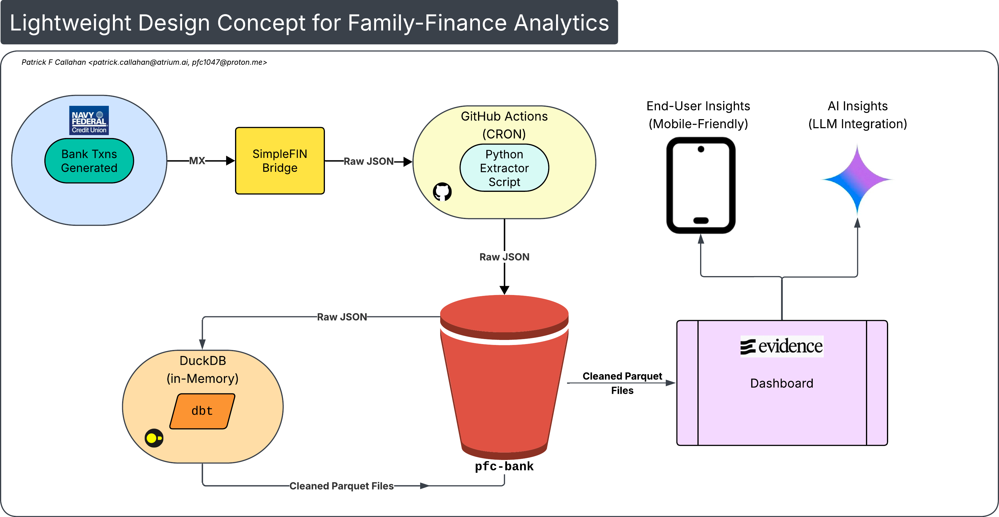

# TL;DR 

Get a mobile-friendly, AI-ready, 360-degree view of your personal finances and budget, for cheap.

Example page at [https://myfinance.patrick-f-callahan.net/](https://myfinance.patrick-f-callahan.net/).

# The Details

*Fig 1: Project Data Flow*

What if, for pennies a day, a single family could benefit from the same kind of High-powered Analytics used by big business? This project attempts to answer how you might do that. 

To do this, we have to meet a few requirements:

1. The pipeline moves real bank transactions and delivers daily updates to keep the data fresh
   - We achieve this with a python script pulling data from real bank accounts via SimpleFIN
   - For moving the actual data, we use dbt and their duckdb adapter
2. The database requires minimal setup and virtually zero maintenance
   - For this, we use DuckDB. Doesn't get any easier than a file-based database that lives entirely in memory
3. The BI Dashboard can be deployed in a mobile-friendly format without depending on paid software or complex client-side configuration
   - For this, we use evidence.dev, a super slick, mobile-first, BI-as-Code toolset that makes snappy dashboarding easy

This allows the every day individual or small family to get deep CPA-level insights onto their own personal finance for no more than the cost of a SimpleFIN subscription ($15/year at time of last edit, or about 4 cents a day.) 

## Stack

### Back-end

- [SimpleFIN](https://beta-bridge.simplefin.org/)
- [dbt](https://docs.getdbt.com/docs/introduction)
- [duckdb](https://duckdb.org/)
- [Python](https://en.wikipedia.org/wiki/Python_(programming_language))

### Front End

- [evidence.dev](https://evidence.dev/)
- [node.js](https://nodejs.org/en)